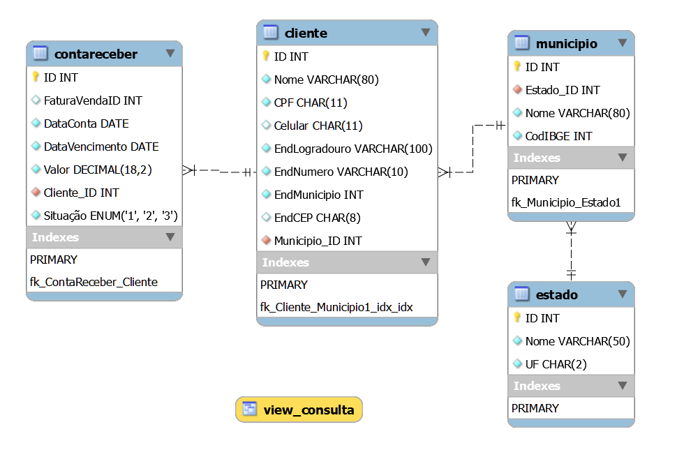

<h1>Relatórios da aula prática da disciplina de desenvolvimento de banco de dados </h1>

## Confira os documentos aqui :100:

- [Roteiro aula prática](https://github.com/OgliariNatan/database_and_data_development/blob/main/aula%20pr%C3%A1tica.pdf)
- [Relatório Final](https://github.com/OgliariNatan/database_and_data_development/blob/main/main.pdf)

### Modelo DER

- 

<h5> Softwares usuais: </h5>

<a href="https://atom.io/">Atom</a>  

 <a href="https://buy.stripe.com/test_14k5lPbFNfLx2hGdQQ">coffe</a>  

